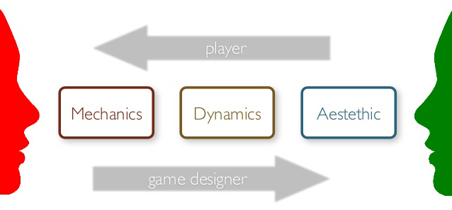

[template]: <https://docs.google.com/document/d/10GITO3XIigZSzCg6e3khjg89FRZBDe_F2TD0VWOqkOA/edit?usp=sharing>
[slides]: <https://docs.google.com/presentation/d/1R0KdxhVw9DITzYugEwiwsXHXqnXJP9Yto32gNltBrOE/edit?usp=sharing>

The **Mechanics, Dynamics, Aesthetics** (MDA) framework was one of the first attempts to develop a theory of game design.

We will practice on the classic version of Tic-Tac-Toe and then you will create an MDA chart for your modified version of Tic-Tac-Toe using the [template][].

## Notes

* MDA concepts
  - Definitions
  - What designers can do
  - What players experience
* Practice with "classic Tic-Tic-Toe" in class.

## Instructions

Use the [template][] to create an MDA chart showing how you modified your new version of Tic-Tac-Toe.

* Use the first row of the chart to define *mechanics, dynamics,* and *aesthetics* in your own words.
* Then fill out the MDA columns for "classic" Tic-Tac-Toe.
* Add your new mechanics in **bold**.
* Strike out (Alt-Shift-5) the mechanics that you have eliminated.
* Repeat for the dynamics and aesthetics.

Submit the document as usual.

## Resources

* [Presentation Slides][slides]
* The original [MDA: A Formal Approach to Game Design and Game Research](https://www.cs.northwestern.edu/~hunicke/MDA.pdf) paper from 2004.
